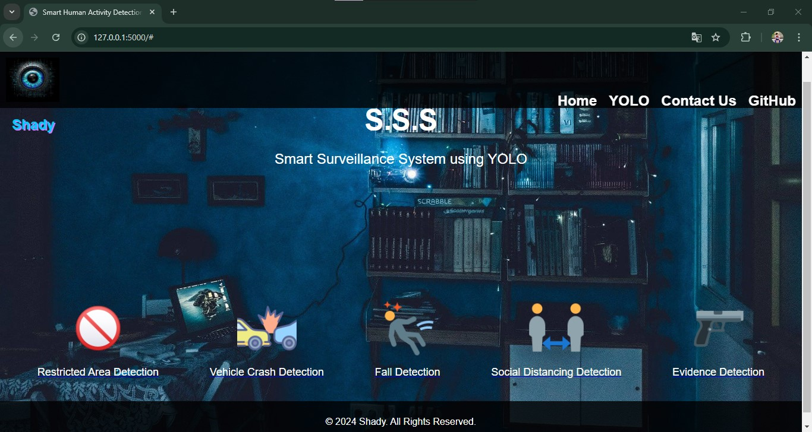
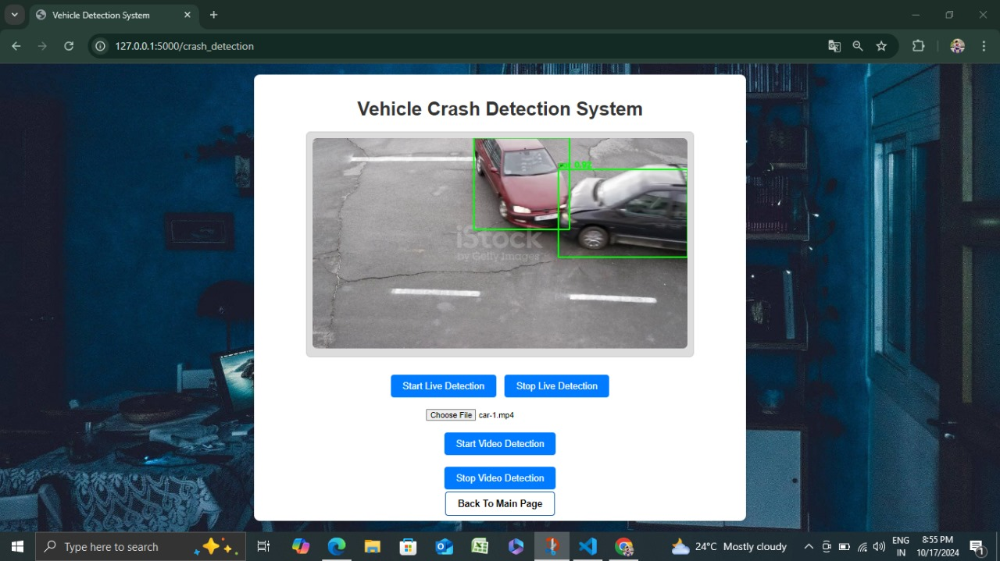
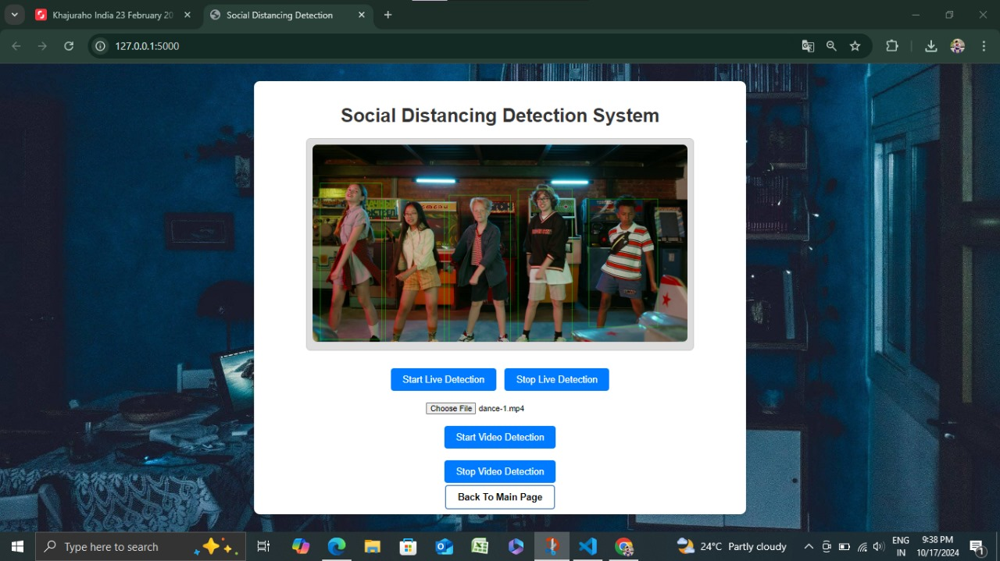
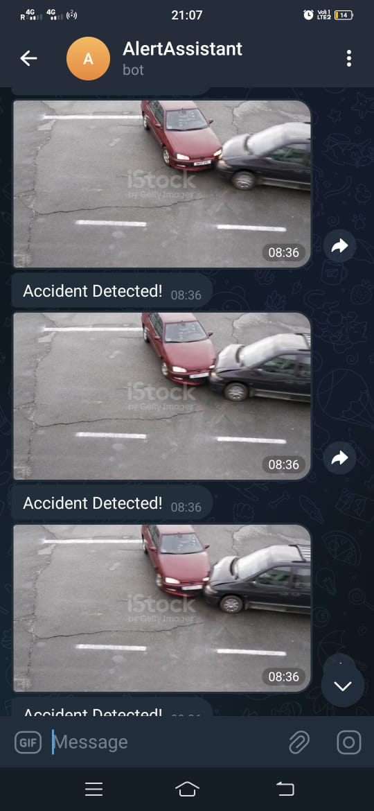
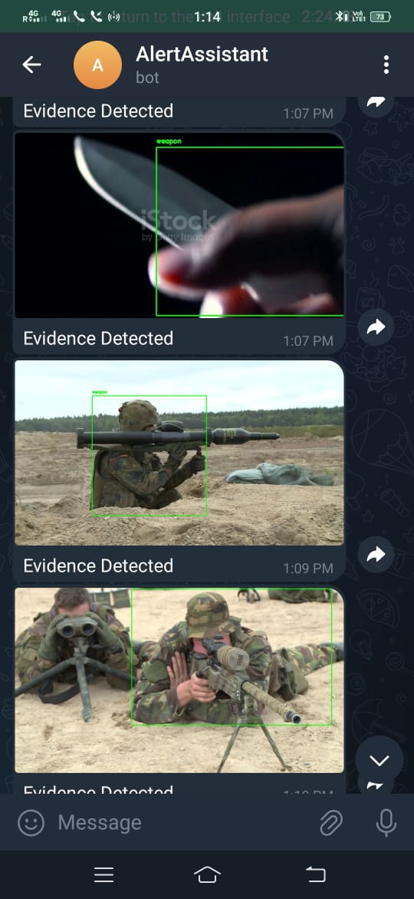

# Smart Surveillance System Using YOLO
This project is a Smart Surveillance System that processes live video feeds or uploaded videos to detect critical scenarios. It leverages YOLO (You Only Look Once) for fast and accurate object detection. The system sends real-time alerts via Telegram, helping users monitor and respond to security events effectively.

# Features
 Real-Time Detection : Monitor live camera feeds to identify objects and activities.
 Video File Analysis : Detect events in uploaded video files.
 Scenario Detection : Includes features like:
Restricted Area Violation
Vehicle Collision Detection
Human Fall Detection
Social Distancing Monitoring
Telegram Notifications : Sends frames of detected events to admins instantly.
Frame Management : Captures and stores relevant frames temporarily for review.
# Getting Started
## Prerequisites
- Python 3.8 or later
- YOLO model configuration and weights files
- Libraries : opencv-python, numpy, torch, requests
- Telegram Bot Token and Chat ID
## Installation
1. Clone the repository:

   ```bash
    git clone https://github.com/Tony-Ranjith/Smart-Surveillance-System.git
   ``` 
2. Navigate to the project directory:

```bash
   cd Smart-Surveillance-System
```
3. Install the required libraries:

```bash
   pip install -r requirements.txt
```
4. Download the YOLO model files:

Place yolov4.cfg, yolov4.weights and and mobilenet files in the project folder. 
Configure Telegram notifications:

Add your Bot Token and Chat ID in the config.py file.
## Dataset
The system uses YOLO pre-trained models on the COCO dataset. You can optionally fine-tune with custom datasets for specific detection tasks.

## Running the Project
Start the application:

```bash
python app.py
```
Select the input source:

- Live Camera Feed
- Upload Video File
View detections in real-time. Notifications for detected events will be sent via Telegram.

## How It Works
### Object Detection:
Uses YOLOv4 for accurate detection of objects and activities.
### Event Handling:
Detects specific scenarios like falls, crashes, or restricted area violations.
### Notifications:
Sends relevant frames of the detected events via Telegram.
### Temporary Frame Storage:
Stores frames for review, automatically cleaning up after a set duration.
### Model Used
- YOLOv4: Optimized for real-time object detection with high accuracy.
## Results
- Detection Accuracy: ~90% for various scenarios.
- Real-Time Processing: Low-latency performance on live feeds.
- Notifications: Instant alerts with relevant frame details.
# Future Improvements
1. Incorporate additional detection scenarios like fire or crowd density.
2. Expand with advanced models like YOLOv8 or custom fine-tuned models.
3. Develop a web-based dashboard for monitoring and managing detections
# Screen Shots Of Project
### Home Page


### Detection Pages
 



### Real time Telegram Notifications on Mobile with Captured frames and alert Messages
   


